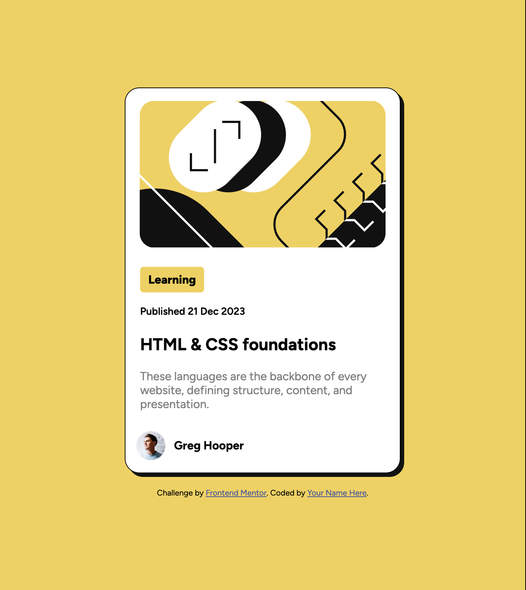

# Frontend Mentor - Blog preview card solution

This is a solution to the [Blog preview card challenge on Frontend Mentor](https://www.frontendmentor.io/challenges/blog-preview-card-ckPaj01IcS). Frontend Mentor challenges help you improve your coding skills by building realistic projects. 

## Table of contents

- [Overview](#overview)
  - [The challenge](#the-challenge)
  - [Screenshot](#screenshot)
  - [Links](#links)
- [My process](#my-process)
  - [Built with](#built-with)
  - [What I learned](#what-i-learned)
  - [Continued development](#continued-development)
  - [Useful resources](#useful-resources)
- [Author](#author)
- [Acknowledgments](#acknowledgments)

**Note: Delete this note and update the table of contents based on what sections you keep.**

## Overview

### The challenge

Users should be able to:

- See hover and focus states for all interactive elements on the page

### Screenshot

### Links

- Solution URL: [https://github.com/Kintama1/blog-preview-card-main]
- Live Site URL: [https://soft-figolla-179ddc.netlify.app/]
## My process
HTML:
- Set up the skeleton of the page based on the example
-Give an ID to each component for clarity(Idk how necessary is this)
CSS:
- Adjust the alignment and placement of all elements using Flexbox (I have done proper research on flexbox by watching a couple of youtube videos)
- Implemented the active version for the blog card
- Adjusted the text font, size and weight accordingly
- Adjusted the profile pic image and the name
Things left to do:
- I still do not know how to design it with both mobile and web versions in mind, in my next project I will be focusing on this
### Built with

- Semantic HTML5 markup
- CSS custom properties
- Flexbox
### What I learned

I have a better understanding of Flexbox as a tool now. I learnt what svg files are, what viewbox and viewport entail. I learnt about box-shadow from checking other solutions to the problem

### Continued development

- Understand how to structure my HTML elements better
- Learn more about different displays and apply them, like gridbox and inline
- I want to be able to do this faster next time

### Useful resources

- [SVG explanation series](https://www.youtube.com/watch?v=ZJSCl6XEdP8) - These series helped explain SVG elements for me, I watched up to the 4th video to get a basic understanding of what I was dealing with. It introduced me to good concepts like Viewport and viewbox
- [Understanding CSS grid](https://www.youtube.com/watch?v=phWxA89Dy94) - This is a great video explaing Flexbox basics. It was a great start to understand how the box aligned and how to control them and play aorund with them

- Website - [Yassine Khayati](https://substack.com/@yassinekhayati?utm_source=profile-page)
## I don't have a website yet, but here is my substack for some articles unrelated to coding that I wrote last summer
- Frontend Mentor - [@yourusername](https://www.frontendmentor.io/profile/yourusername)
- Twitter - [@@khayati_yassin](https://twitter.com/khayati_yassin)

## Acknowledgments

Thank you for the Frontend mentor team for providing another great challenge to practise HTML and CSS for newcomers!